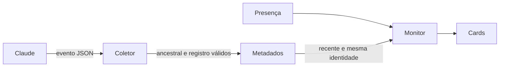

# Atividade do Claude Code

> Status: construção autorizada pelo usuário em 2026-10-06; prova isolada concluída.

## Situation

Capy está em construção e já comprova presença pelo registro de sessão e criação do processo. A integração Codex serve como precedente de observação sem respostas. Errar o estado pode manter uma intervenção antiga visível; a habilitação precisa ser reversível.

## Problem

O usuário reconhece sessões Claude abertas, mas não consegue acompanhar trabalho ou necessidade de intervenção no Capy. Esta é a próxima capacidade do roteiro aprovado.

## Success

Eventos reais permitem distinguir trabalho e espera recente na sessão correta. A espera desaparece após continuação, negação, término, expiração ou perda de presença. Observação ambígua mostra `unknown`.

## Boundary

In: hooks locais de comando, metadados de atividade, habilitação reversível, cards existentes e diagnóstico.

Out: respostas, conteúdo de pedidos, terminal, histórico, credenciais, cotas e Antigravity.

## Shape

Um observador silencioso registra o último evento da sessão validada; o monitor cruza esse registro com a presença atual. O usuário habilita ou remove apenas os hooks do Capy por um script local. Um servidor persistente só se justifica caso seja necessário receber eventos em tempo real; a atualização existente de cinco segundos permite usar arquivos limitados.

## Key decisions

1. **Identidade completa.** O coletor precisa ser descendente do processo Claude registrado; identificador, PID, criação e projeto devem coincidir. Subagentes não atualizam o estado principal.
2. **Eventos são evidência parcial.** `UserPromptSubmit`, `PreToolUse`, `PostToolUse`, `PostToolUseFailure`, `PostToolBatch` e `PermissionDenied` indicam `working`; `PermissionRequest` e notificação `permission_prompt` indicam `waiting`. `SessionStart`, `Stop`, `StopFailure`, `SessionEnd` e notificações não reconhecidas invalidam para `unknown`. `idle_prompt` indica `idle`. `Stop` nunca prova ociosidade: outros hooks podem continuar a execução em paralelo.
3. **Expiração.** Evidência dura no máximo 30 segundos; trabalho e espera longos passam a `unknown` sem novos eventos. Ociosidade não representa conclusão. Nenhum pedido executável é criado.
4. **Minimização.** Persistir somente versão, sessão, projeto, PID/criação, instante e estado. Entrada limitada a 1 MiB; registro limitado a 64 KiB; até 64 sessões por ciclo. Eventos anteriores não são armazenados. Arquivos de sessões encerradas são removidos pelo coletor na próxima escrita, com varredura limitada a 128 entradas.
5. **Coexistência.** Acrescentar grupos próprios sem modificar hooks existentes. Remoção apaga somente o comando do Capy. Falha de configuração não altera o arquivo. Reiniciar sessões Claude para carregar a habilitação; sessões sem evidência permanecem desconhecidas.

## Work

### Atividade

| State | What should happen |
|---|---|
| Evento recente vinculado à presença | Mostrar estado da decisão 2 |
| Nova atividade depois de espera | Remover espera |
| Stop seguido de continuação | Unknown até próxima evidência; nunca concluída |
| Registro antigo, incompatível, bloqueado ou identidade divergente | Unknown |
| Processo encerrado | Descoberta omite sessão |
| Hooks removidos | Invalidar registros do Capy; unknown |

Contrato: `--claude-hook` lê stdin, não escreve stdout nem decide permissões. `--activity-report` inclui enriquecimento Claude e Codex. Registros usam `version`, `session_id`, `cwd`, `pid`, `proc_start`, `at_ms`, `state`.

## Sources

- NEXT_STEPS.md — prioridade e prova isolada.
- [Hooks](https://code.claude.com/docs/en/hooks) — eventos, execução paralela e continuação de Stop.
- [User input](https://code.claude.com/docs/en/agent-sdk/user-input) — espera e resposta de permissão no host de teste.
- [CLI](https://code.claude.com/docs/en/cli-reference) — settings por sessão e entrada/saída stream-json.
- .checks/claude-hooks-spike.md — sequência real e limites da prova.
